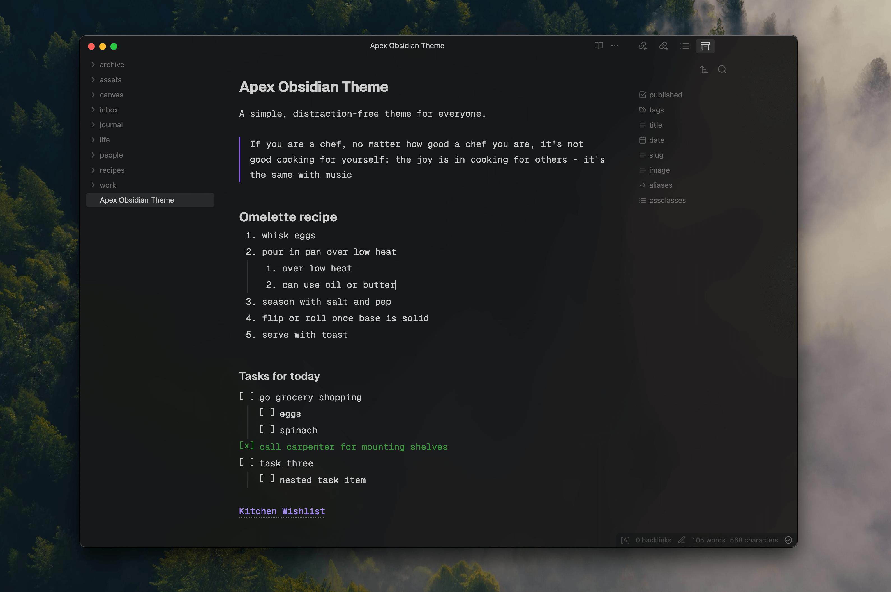

# Apex Obsidian Theme

A simple, distraction free theme for [Obsidian](https://www.obsidian.md), crafted by [Sid](https://www.sid.me) and [Vignesh](https://twitter.com/c_m_vignesh) for folks who:

1. prefer simpler things
2. love monospaced type
3. use hotkeys to navigate

If you're comfortable with Vim keybinds, you can absolutely fly through the UI and type away at the speed of thought! It currently works best on macOS but if you run into issues on your platform, please raise them with us and we'd love to help.

## Issues / Feature Requests

This [Github repo](https://www.github.com/clearlysid/apex) is the best place to raise something to us. Alternatively, you can send an email to **siddharth99c@gmail.com**.

## Development Guide

1. Clone this repo
2. Remove the `.example` from the `.env.example` and provide the path to your Obsidian vault
3. Run `npm i` to install all dependencies
4. Run `npm start` to "watch" all `src/*.css` files and compile the theme with hot reloads.

## Acknowledgements

-   We used the [Obsidian Sample Theme](https://github.com/obsidianmd/obsidian-sample-theme) as a starting point.
-   The CSS build process is based on [Minimal Theme](https://github.com/kepano/obsidian-minimal).
-   Typeset in the beautiful [Geist and Geist Mono](https://vercel.com/font) by Vercel.
